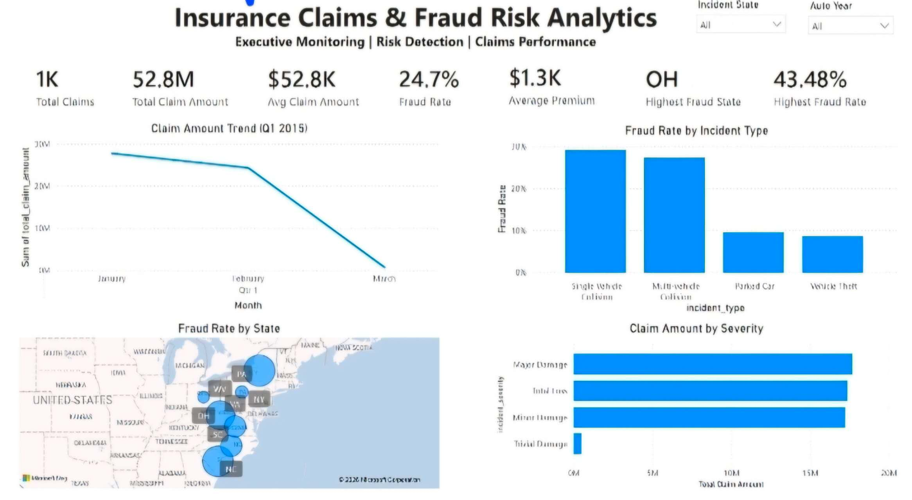
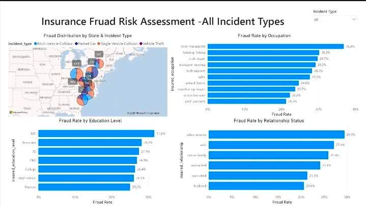
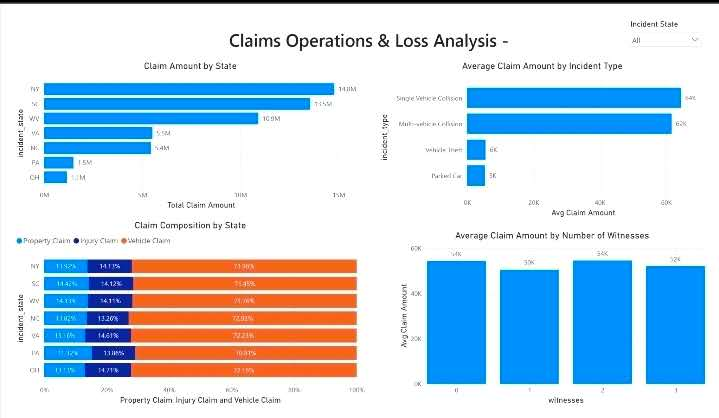
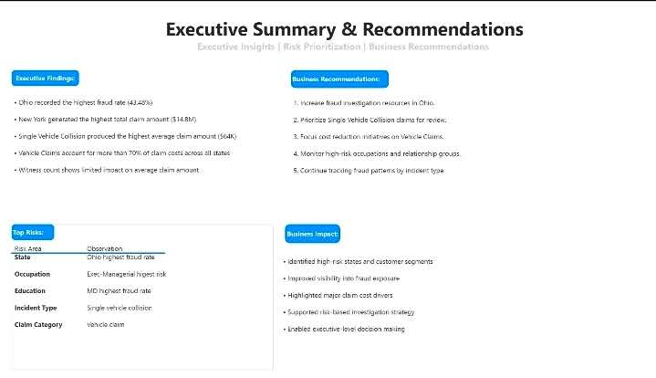

# Insurance Claims Power BI Dashboard

An interactive Power BI dashboard designed to help insurance stakeholders monitor claims performance, detect fraud patterns, and support executive decision-making.

---

# Project Summary

This dashboard helps business stakeholders monitor insurance claims performance by analyzing claim amounts, fraud risk, policyholder characteristics, and operational trends across multiple states.

The dashboard provides an executive-level view of claims operations to support fraud detection, risk assessment, claims management, and data-driven business decision-making.

| Item | Details |
|------|---------|
| **Industry** | Insurance |
| **Role** | Power BI Developer |
| **Dashboard Type** | Executive Claims & Fraud Analytics Dashboard |
| **Audience** | Claims Managers, Fraud Investigation Team, Business Stakeholders |
| **Tools** | Power BI, Power Query, DAX |
| **Data Source** | Kaggle Insurance Claims Fraud Detection Dataset |
| **Skills** | Data Modeling, KPI Design, Fraud Analytics, Executive Reporting, Data Visualization, Business Analysis |

---

# Dashboard Preview

## Executive Overview

- Provides an executive overview of claims volume, fraud rate, premium performance, and claim trends.

---

## Fraud Risk Assessment

- Highlights high-risk states, occupations, education levels, and customer segments associated with insurance fraud.

---

## Claims Operations & Loss Analysis

- Analyzes claim costs, incident types, claim composition, and operational loss drivers.

---

## Executive Summary & Recommendations

Summarizes executive findings, business recommendations, top risks, and overall business impact.

---

# Business Problem

Insurance companies process thousands of claims while balancing customer satisfaction, operational efficiency, and fraud prevention.

Without centralized reporting, business stakeholders struggle to:

- Detect high-risk fraud patterns
- Identify costly claim categories
- Monitor regional claim performance
- Prioritize fraud investigation resources
- Reduce unnecessary claim expenses

---

# Business Questions

This dashboard answers questions such as:

- Which states have the highest fraud rate?
- Which incident types generate the highest claim amounts?
- Which customer segments present higher fraud risk?
- What claim categories contribute most to total losses?
- How should fraud investigation resources be prioritized?

---

# Key Insights

### Executive Monitoring

- Processed over **1,000 insurance claims**
- Total claim amount exceeded **$52.8M**
- Overall fraud rate reached **24.7%**

### Fraud Detection

- Ohio recorded the highest fraud rate
- Single Vehicle Collision presented the highest fraud risk
- Executive/Managerial occupations showed elevated fraud exposure

### Claims Operations

- New York generated the highest total claim amount
- Vehicle claims accounted for the majority of claim costs
- Witness count showed limited impact on average claim amount

### Executive Recommendations

- Prioritize fraud investigations in high-risk states
- Focus reviews on high-risk incident types
- Improve monitoring of high-risk customer segments
- Optimize resource allocation using fraud analytics

---

# Data Preparation

Data preparation was completed using Power Query, including:

- Data cleansing
- Missing value handling
- Data type transformation
- Feature engineering
- KPI calculation
- Interactive filtering

---

# Tools Used

- Power BI
- Power Query
- DAX

---

# Data Source

**Kaggle – Insurance Claims Fraud Detection Dataset**

---

# Skills Demonstrated

- Data Modeling
- DAX
- Power Query
- KPI Development
- Fraud Analytics
- Executive Dashboard Design
- Interactive Reporting
- Business Storytelling

---

# Business Value

This dashboard enables insurance stakeholders to:

- Detect fraud more efficiently
- Improve claims investigation
- Monitor operational performance
- Reduce financial losses
- Support executive decision-making with data

---

# Future Improvements

Potential future enhancements include:

- Machine Learning fraud prediction
- Real-time claims monitoring
- Automated fraud alerts
- Predictive claim severity analysis
- Geographic risk forecasting
